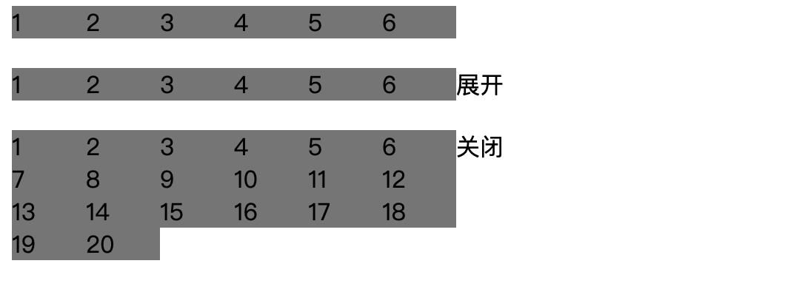

内容的展开收起

安装

```
npm i vue-fold-and-unfold
```

参数

```
active.sync   展开收起状态 Boolean
height            收起时的高度 Number
```
使用示例

```html
<template>
  <div class="">
    <!-- 不超出 -->
    <FoldAndUnfold :height="22">
      <div class="box-list">
        <span v-for="item in 6" class="box">{{item}}</span>
      </div>
    </FoldAndUnfold>

    <div style="height:20px;"></div>

    <!-- 超出 -->
    <FoldAndUnfold :active.sync="active1" :height="22">
      <div class="box-list">
        <span v-for="item in 20" class="box">{{item}}</span>
      </div>
    </FoldAndUnfold>

    <div style="height:20px;"></div>

    <!-- 超出默认展开 -->
    <FoldAndUnfold :active.sync="active2" :height="22">
      <div class="box-list">
        <span class="box" v-for="item in 20">{{item}}</span>
      </div>

      <span slot="active">关闭</span>
    </FoldAndUnfold>
  </div>
</template>

<script>
  // import FoldAndUnfold from './fold-and-unfold.vue';
  import FoldAndUnfold from "vue-fold-and-unfold";

  export default {
    name: "",

    props: [],

    components: {
      FoldAndUnfold,
    },

    data() {
      return {
        active1: false,
        active2: true,
      };
    },

    computed: {},

    methods: {
      async getData() {},
    },

    created() {
      console.log(FoldAndUnfold);
      this.getData();
    },
  };
</script>

<style>
  .box-list {
    display: flex;
    flex-wrap: wrap;
    width: 300px;
  }

  .box {
    display: block;
    width: 50px;
    background-color: gray;
  }
</style>
```

示例


